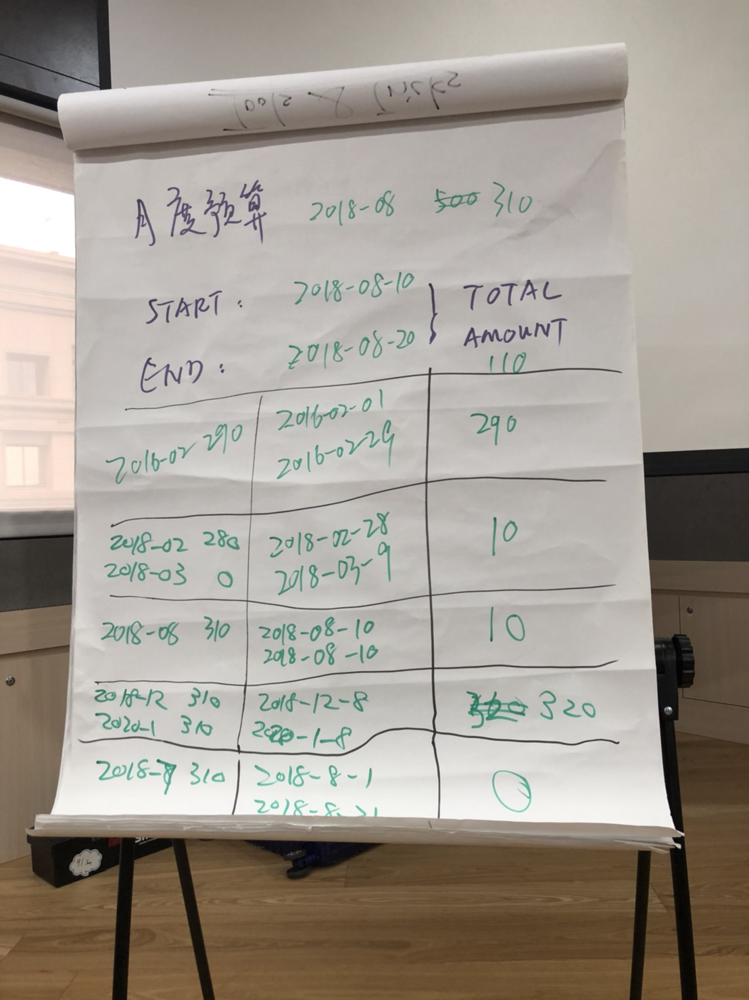
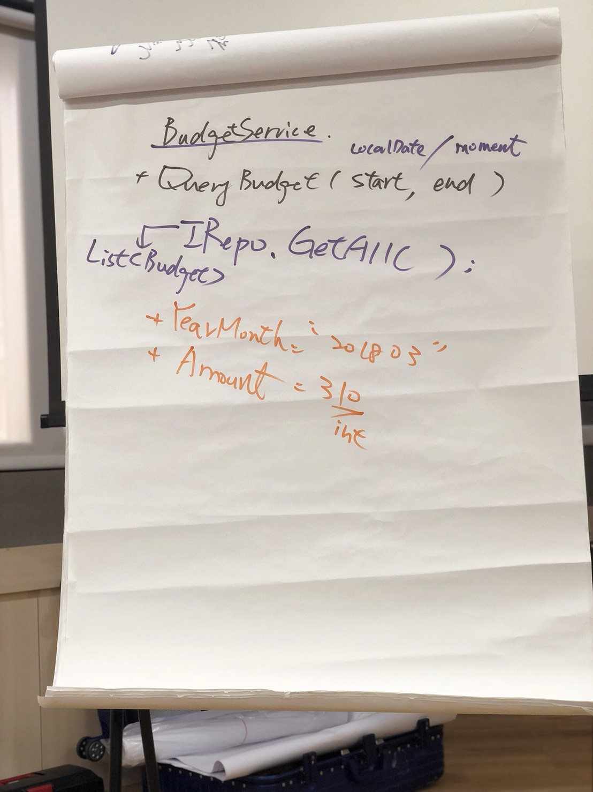

# Budget Lab
unit test training day2 - monthly budget

- requirement:
	- monthly budget. 2018-08 $310
	- input: (start, end) = (2018-08-10, 2018-08-20)
	- output: total amount $110
	
	- Please implement BudgetService class to `float getBudget()`
	- 四捨五入到小數點第二位

	- already have:
		- IRepo interface: with getAll() to return List<Budget>
		- Budget class: String yearMonth and int amount
		
- 先討論分析出所有涵蓋的test cases
- TODO:
	- refactor production code
	- refactor test code

